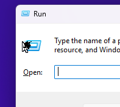

# Dead Pixel Simulator

Because who doesn't love a dead pixel on the screen ...



As seen on YouTube (link to be updated once the video is online).

## READ THIS BEFORE YOU ACTUALLY RUN THE THING

- **Never set $SpeedLevel higher than $MaxPixels. You will regret it, trust me.**
- **Never run more than 1 instance at the same time. You will regret this one even more.**
- **Exit the simulator with F7.**
- Your mouse will feel sluggish, that's expected and normal.
- Yes, anything that changes your cursor will give the trick away, as you will see two cursors. 80/20 rule, guys.
- To kill the simulator (in case F7 does not work or something like that), you have to run `taskkill /f /im powershell.exe` as the generator actually runs as a PowerShell script in the background. The original exe just drops the script and then exits.
- **If you kill the script via taskkill/task manager, your cursor will be invisible. <ins>DON'T PANIC.</ins>** You can still use your cursor, but it is invisible. Two ways to fix:
	- Restart your computer / log out. Easiest fix.
	- Use your keyboard to restore the cursor.
		1. Start button
		2. Enter in the search (just type away): "Change the mouse pointer display or speed" and press enter to open the menu
		3. Use your keyboard to navigate to the "Pointers" tab (Shift+Tab > Left button)
		4. Tab into the cursor selection dropdown (press Tab once - it will most likely say "Windows Default (system scheme)" for you)
		5. Press UP then DOWN - we need the dropdown selection to change away and then back
		6. Hit Alt+A for Apply (or, if you are not using English, whatever letter is underlined on the "Apply" button instead of A).
		7. Done, cursor is back.

## Why is this a weird repo and not just a downloadable .EXE?

I made the experience with [BlueScreenSimulator](https://github.com/FlyTechVideos/BluescreenSimulator) that AVs were overly eager to mark it as "JokeWare" which led to loads of false detections. While I understand the reasons behind it (after all, certainly not a professional software), it did cause many people to be concerned about it.

This time, I provide you with the scripts to self compile. Basically all you have to do is this:

1. Clone the repo / download as ZIP
2. Unzip (if zipped) and open a PowerShell inside
3. Run this code

```powershell
Set-ExecutionPolicy Bypass –Scope Process
.\Compiler.ps1
```

4. An exe file named "simulacron.exe" will spawn.
5. Enjoy.
6. Usually, you should be able to run it at least once after generation without AV interfering. Should Defender/your AV remove the EXE at some point (probably something like "Wacatac"), just continue from step 3. Should that also not work anymore, change the config values in [_Packager.cs](./_Packager.cs) and/or the .ico file and try again.

## What can I change?

### Configurations regarding the dead pixels

You can change some stuff regarding the dead pixel generation. The constants are at the top of [_DeadPixelSimulator.ps1](./DeadPixelSimulator.ps1). They should be fairly self explanatory.

Should you desire different patterns, more configs etc. please consult the clanker programmer of your choice. (No shame.)

### Configurations regarding the generated EXE

- Want to change the data in properties? Open [_Packager.cs](./_Packager.cs) and adapt the values on the top of the file.
- Want to change the icon? The script literally just takes **DeadPixel.ico**. Replace that with whatever you want and run the compiler script again. Note: Must be a valid .ico file. Just renaming a .png to .ico will not work.
- Want to change the generated filename? You can either change the name in Compiler.ps1 or ... hear me out ... just rename the output file.

### Final Remarks

This thing is not destructive, not a virus, not malware. It's a little joke program. However you are responsible for what you are doing with it. Follow the instructions and stay safe. Take care.
